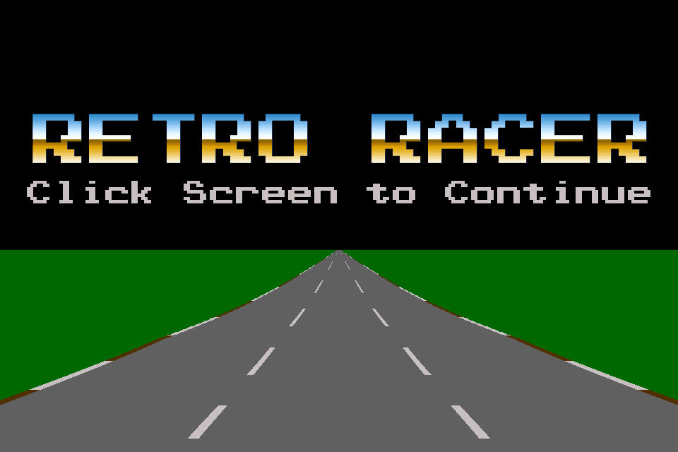
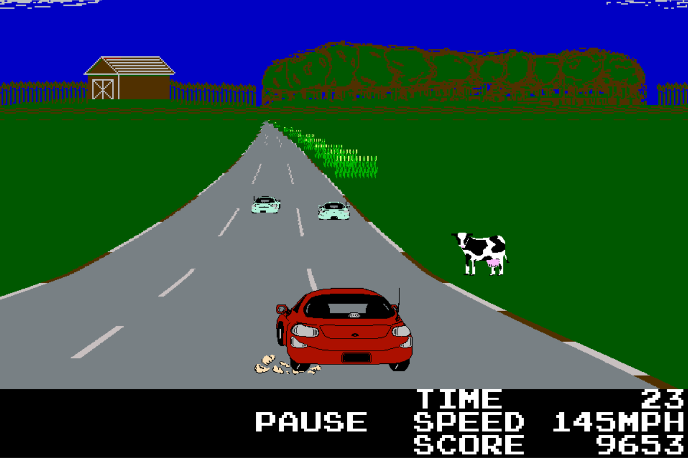

# Retro Racer

Written in App Game Kit Classic (v1.7), Retro Racer was inspired by classic racing games and was published for iOS, Android, and Windows platforms in 2013.

Retro Racer has:

* 9 different tracks
* Four gameplay modes
* Downloadable content

## Screenshots

 

## License

Due to licensing issues, all music has been stripped from the app. Only incidental sound effects remain.

---

This work is licensed under a
[Creative Commons Attribution-ShareAlike 4.0 International License][cc-by-sa].

[![CC BY-SA 4.0][cc-by-sa-image]][cc-by-sa]

[cc-by-sa]: http://creativecommons.org/licenses/by-sa/4.0/
[cc-by-sa-image]: https://licensebuttons.net/l/by-sa/4.0/88x31.png
[cc-by-sa-shield]: https://img.shields.io/badge/License-CC%20BY--SA%204.0-lightgrey.svg